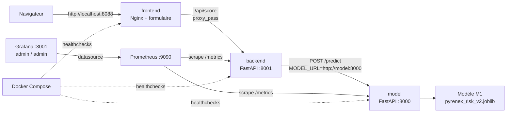

# M5-B1 + M5-B2 — Pyrenex Prod (architecture, CI/CD, monitoring, éval continue)

> **Date** : 2026-09-02
> **Binôme M5-B1** : Tom & Célia
> **M5-B2** : individuel (Célia, branche `M5-B2-celia`)

## 📝 Résumé

Ce repo met en **production** le modèle de scoring crédit Pyrenex (repris de
M1) : 3 services orchestrés (`model` / `backend` / `frontend`), pipeline
CI/CD GitHub Actions, monitoring Prometheus/Grafana et runbook d'astreinte
(M5-B1), puis **évaluation continue** du modèle sur un jeu de référence figé
avec tracking MLflow et garde-fou bloquant en CI (M5-B2).

---

## ✅ Checklist livrables

**M5-B1 — avant mercredi 12h30**

- [x] `docker compose up --build` démarre les **3 services** de façon **reproductible**, healthchecks verts
- [x] `/metrics` exposé côté `model` **et** `backend`
- [x] Dashboard Grafana provisionné **automatiquement** (3 panels : vie / vitesse / comportement)
- [x] Workflow CI **vert**, image poussée sur GHCR, tag `v1.0.0-prod`
- [x] Le **contract test** du modèle bloque la release s'il est rouge
      *(il vérifie le **contrat technique** de l'API — pas la performance du
      modèle : ça, c'est l'évaluation continue de B2)*
- [x] `runbook.md` — 4 procédures (Service KO / Latence / Métrique modèle / Rollback)
- [x] `README.md` — schéma Mermaid de l'archi + démarrage en 3 commandes
- [x] Commits binôme : `Co-authored-by:` ou auteurs nominatifs

**M5-B2 — avant vendredi 17h**

- [x] `data/reference_set.csv` (~500 lignes) **construit par vous** depuis le holdout M1, figé, versionné
- [x] `data/reference_baseline.json` — le golden run, gelé sur **ce** jeu
- [x] `scripts/evaluate_model.py` — 4 métriques, ≥ 2 runs MLflow comparables
- [x] `evaluation_thresholds.md` — 4 métriques × golden run / plancher absolu / baisse max / **justification**, tolérance relative ≥ 2 σ (bootstrap)
- [x] Étape `evaluate-model` dans la CI : `--degrade` fait **échouer** la release
      *(`mlruns/` est gitignoré : la preuve passe par l'**artefact CI**, pas par un commit)*
      
      => Captures disponibles dans le **`notebook/notebook.ipynb`**
---

## 🏗️ Schéma d'architecture



| Service | Port hôte | Rôle |
|---|---:|---|
| `frontend` | 8088 | Formulaire web servi par Nginx, proxy `/api/` vers le backend |
| `backend` | 8001 | Orchestrateur FastAPI : valide la requête, appelle `model`, expose `/health` et `/metrics` |
| `model` | 8000 | API de scoring M1 : `/predict`, `/health`, `/metrics` |
| `prometheus` | 9090 | Scrape les métriques `model` et `backend` |
| `grafana` | 3001 | Dashboard provisionné depuis Prometheus |

---

## 📊 Évaluation continue

À chaque release, `scripts/evaluate_model.py` recalcule 4 métriques
(`f1_macro`, `f1_default`, `roc_auc`, `recall_default`) sur le jeu de
référence figé `data/reference_set.csv` (500 lignes, sous-échantillon du
holdout M1, 18% de défauts) et les compare au **golden run**
(`data/reference_baseline.json`), pas à la baseline holdout communiquée en
M1 — les deux jeux n'ont ni la même taille ni la même composition.

- **Seuils** : stratégie hybride (plancher absolu + baisse max vs golden
  run), dimensionnés par bootstrap (≥ 2σ de bruit mesuré) et justifiés dans
  [`evaluation_thresholds.md`](./evaluation_thresholds.md) ;
  visualisation dans [`notebook/thresholds.ipynb`](./notebook/thresholds.ipynb).
- **Tracking** : chaque run est loggé dans MLflow (`mlflow ui`) avec
  métriques, paramètres (`model_version`, `reference_set`, `n_reference`) et
  tag `release_blocked`.
- **Garde-fou CI** : le job `evaluate-model` du workflow
  [`ci.yml`](./.github/workflows/ci.yml) exécute le script et **bloque la
  release** (code retour non-zéro) en cas de dépassement de seuil — testé
  via `--degrade` (désalignement volontaire X/y).
- **Tests** : `tests/test_evaluation.py` couvre le calcul des métriques, la
  comparaison aux seuils et le chargement/gel du golden run
  (`.venv\Scripts\python.exe -m pytest tests`).

```powershell
python scripts/evaluate_model.py --freeze-baseline     # une fois, au gel du jeu
python scripts/evaluate_model.py --release-tag v2.0.0
```

---

## 🚀 Démarrage en 3 commandes

```powershell
python -m venv .venv
.venv\Scripts\python -m pip install -r requirements-dev.txt
docker compose up --build
```

> 🧰 **Avec `uv`** : remplacez les 2 premières commandes par `uv venv` puis
> **`uv pip install -r requirements-dev.txt`**.
> ⚠️ Un venv créé par `uv venv` **n'embarque pas `pip`** : si vous voyez
> `No module named pip`, c'est ça — utilisez `uv pip install`, pas `pip install`.

> ⚠️ **Ports hôte** : frontend **8088** (pas 8080), Grafana **3001** (pas 3000)
> — pour éviter les conflits courants. Model 8000, backend 8001, Prometheus 9090.

Une fois le compose démarré, ouvrez :

- Frontend : <http://localhost:8088>
- Backend : <http://localhost:8001/health>
- Model : <http://localhost:8000/health>
- Prometheus : <http://localhost:9090>
- Grafana : <http://localhost:3001> (`admin` / `admin`)

Contrôle rapide optionnel :

```powershell
.venv\Scripts\python -m pytest
```

---

## 📁 Structure

```
services/
  model/
  backend/
  frontend/
prometheus/
grafana/provisioning/
  datasources/
  dashboards/
.github/workflows/ci.yml
runbook.md
data/
  README.md
  reference_set.csv
  reference_baseline.json
scripts/evaluate_model.py
evaluation_thresholds.md
notebook/thresholds.ipynb
tests/test_evaluation.py
ressources/
```

> Le service `model` est l'**exemple de référence** : il expose déjà
> `/metrics` — pattern répliqué sur le `backend`.

---

## 📚 Ressources

Voir [`./ressources/`](./ressources/) — 8 mini-cours + `liens_officiels.md`.
Lecture **juste-à-temps** : ouvrez le mini-cours de la tâche en cours.
