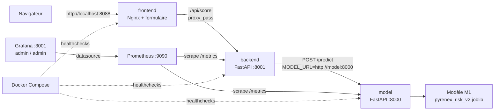

# M5-B1 + M5-B2 — Pyrenex Prod (architecture, CI/CD, monitoring, éval continue)
---

## 🏗️ Schéma d'architecture



| Service | Port hôte | Rôle |
|---|---:|---|
| `frontend` | 8088 | Formulaire web servi par Nginx, proxy `/api/` vers le backend |
| `backend` | 8001 | Orchestrateur FastAPI : valide la requête, appelle `model`, expose `/health` et `/metrics` |
| `model` | 8000 | API de scoring M1 : `/predict`, `/health`, `/metrics` |
| `prometheus` | 9090 | Scrape les métriques `model` et `backend` |
| `grafana` | 3001 | Dashboard provisionné depuis Prometheus |

---

## 🚀 Démarrage en 3 commandes

```powershell
python -m venv .venv
.venv\Scripts\python -m pip install -r requirements-dev.txt
docker compose up --build
```

> 🧰 **Avec `uv`** : remplacez les 2 premières commandes par `uv venv` puis
> **`uv pip install -r requirements-dev.txt`**.
> ⚠️ Un venv créé par `uv venv` **n'embarque pas `pip`** : si vous voyez
> `No module named pip`, c'est ça — utilisez `uv pip install`, pas `pip install`.

> ⚠️ **Ports hôte** : frontend **8088** (pas 8080), Grafana **3001** (pas 3000)
> — pour éviter les conflits courants. Model 8000, backend 8001, Prometheus 9090.

Une fois le compose démarré, ouvrez :

- Frontend : <http://localhost:8088>
- Backend : <http://localhost:8001/health>
- Model : <http://localhost:8000/health>
- Prometheus : <http://localhost:9090>
- Grafana : <http://localhost:3001> (`admin` / `admin`)

Contrôle rapide optionnel :

```powershell
.venv\Scripts\python -m pytest
```

---

## 📁 Structure

```
services/
  model/        # FOURNI — API scoring M1-B2 + /metrics (ne pas réécrire)
  backend/      # À COMPLÉTER — orchestrateur (tâche 2)
  frontend/     # À COMPLÉTER — formulaire nginx (tâche 2)
prometheus/     # FOURNI — scrape config
grafana/provisioning/
  datasources/  # FOURNI — datasource Prometheus
  dashboards/   # provider fourni ; le dashboard JSON = à vous (tâche 9)
.github/workflows/ci.yml   # squelette (job test fourni) — tâche 5
runbook.md                 # template 4 sections — tâche 10
data/README.md                       # B2 — d'où vient votre jeu de référence
data/reference_set_TEMPLATE.csv      # B2 — exemple de FORMAT (20 lignes), pas un jeu
scripts/evaluate_model_TEMPLATE.py   # B2 — MLflow pré-câblé
evaluation_thresholds_TEMPLATE.md    # B2 — seuils à justifier
ressources/                # 📚 mini-cours d'appui (lecture juste-à-temps)
```
---

## 🧪 Évaluation continue
 
À chaque release, `scripts/evaluate_model.py` recalcule 4 métriques
(F1 macro, F1 défaut, ROC-AUC, recall défaut) sur un jeu de référence figé
(`data/reference_set.csv`, 500 lignes, composition 250 défauts / 250
non-défauts — argumentée dans `evaluation_thresholds.md`), les compare au
**golden run** gelé (`data/reference_baseline.json`), et bloque la release
(code retour non-zéro → job CI `evaluate-model` rouge) si un seuil est
dépassé.
 
⚠️ Le garde-fou compare au golden run — **jamais** aux métriques du holdout
M1 annoncées au client (F1 macro 0.613, cf. `services/model/models/pyrenex_risk_v2.json`,
clé `metrics_holdout`) : les deux jeux n'ont ni la même taille ni la même
composition, comparer les deux mesurerait un écart de population, pas une
dégradation du modèle.

### Utilisation
 
```bash
python scripts/evaluate_model.py --freeze-baseline     # une fois, au gel du jeu de référence
python scripts/evaluate_model.py --release-tag v2.0.0   # à chaque release
python scripts/evaluate_model.py --release-tag test --degrade   # test du chemin rouge
mlflow ui                                                # comparer les runs tracés (params + 4 métriques)
```
### Seuils
 
Détail complet, chiffres mesurés et justifications dans
[`evaluation_thresholds.md`](./evaluation_thresholds.md). Stratégie
**hybride** : plancher absolu (métier) + tolérance relative fixée à **2σ**,
le σ étant mesuré par bootstrap (500 tirages) sur le jeu de référence.
 
### Procédure de mise à jour des seuils
 
- **Qui** : la personne qui modifie le modèle ou le jeu de référence, revue
  par Sophie Léger avant merge sur `main`.
- **Quand** : uniquement lors d'un changement de modèle en profondeur
  (nouvelle version majeure) ou du jeu de référence lui-même — jamais pour
  faire passer une release au vert.
- **Comment** : garder `THRESHOLDS` dans `scripts/evaluate_model.py` et
  `evaluation_thresholds.md` strictement cohérents. Si le jeu de référence
  change, **regeler le golden run** (`--freeze-baseline`) puis relancer le
  bootstrap pour requantifier le bruit.
### Preuve du chemin rouge (CI)
 
Testé le 16/09/2026 en poussant une dégradation volontaire (`--degrade`,
désalignement X/y) sur la branche `Tom` : le job `evaluate-model` du workflow
GitHub Actions est passé rouge comme attendu — [lien ou capture du run à
insérer].
 
### Tests
 
`tests/test_evaluation.py` (12 tests, câblés dans le job `test` de la CI) :
logique des seuils (plancher absolu, tolérance relative), reproductibilité
de la dégradation volontaire, cycle golden run (`freeze_baseline` /
`load_baseline`), garde-fou sur la validité du jeu de référence (< 100 lignes
ou mono-classe rejeté).
 
```bash
pytest -v tests/test_evaluation.py
```